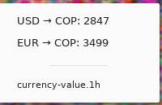

# Currency value

Use the nice [Alpha Vantage][1] api to transform from X to Y currency where
the values are any physical or digital currency supported by the [Alpha Vantage][1]
API.

## How to use

### Command line

    $ currency-values <from-currency> <to-currency> <your-alpha-vantage-api>
    
### Argos

just write a file `~/.config/argos/currency-value.1h.sh`

    #!/usr/bin/env bash
    
    echo "Currency"
    echo "----"
    /home/rkmax/Development/go/bin/currency-values USD COP 1234567890ABCDEF
    /home/rkmax/Development/go/bin/currency-values EUR COP 1234567890ABCDEF
    
You will see something like

 

[1]: https://www.alphavantage.co
[2]: https://www.alphavantage.co/support/#api-key